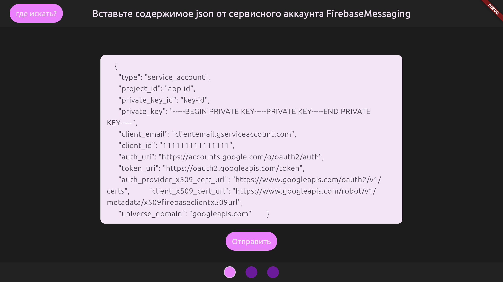
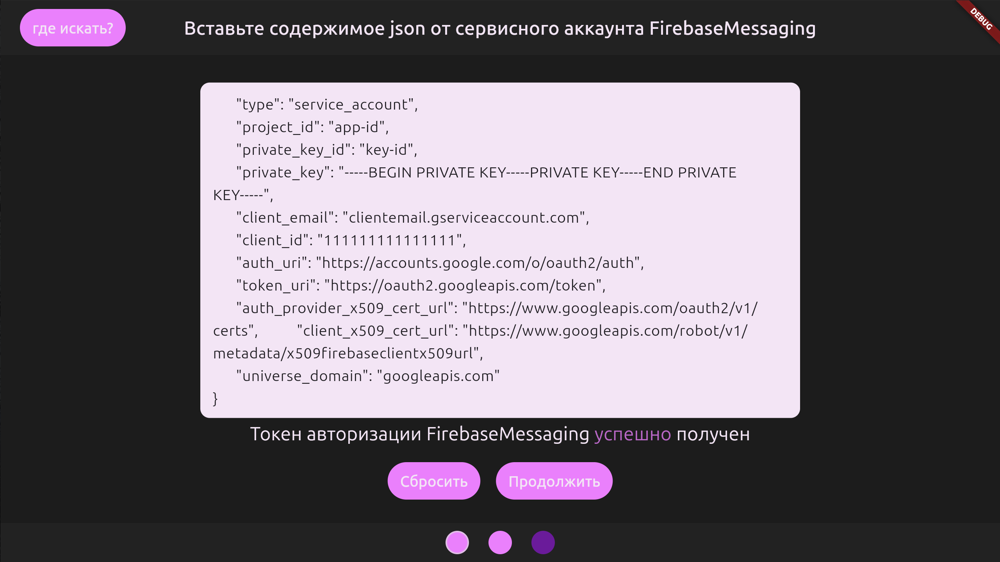
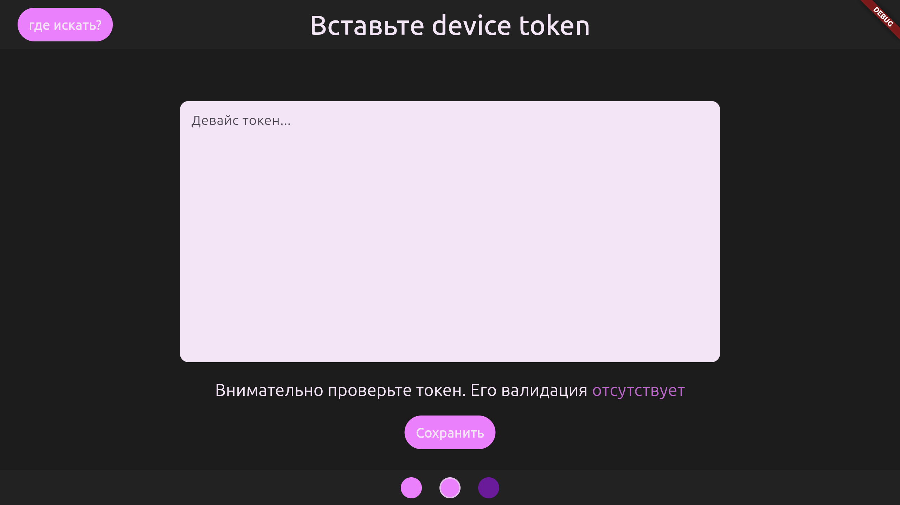
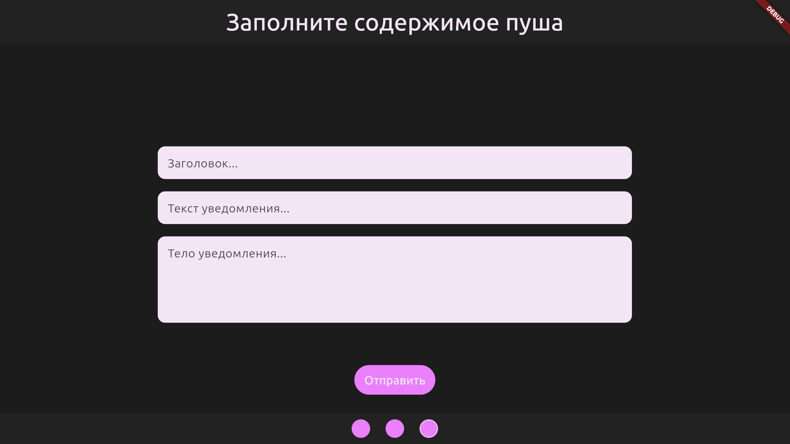
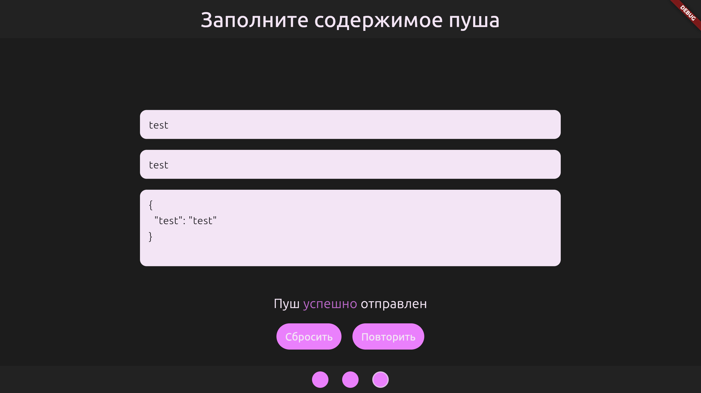

# push_by_token_tester

An application that allows you to send a firebase push message on a device by its token, written with Dart/Flutter and Bloc architecture. It is fully working on Linux and Macos and covered with tests, so feel free to use it.

## Getting Started

There are **two build confings** available:

- **push_token_tester** that runs main.dart and uses real repositories.
- **mock** that runs main_mock.dart and uses fake ones.

Screenshots are made with **mock** build and using fake data. **Do not share your FCM credentials**
and device token. Better make a new service credentials, give them proper rights,
and delete them from the account after the job done.

1) Retreive service credentials of your Firebase project.

2) Get the device token.

3) Complete any data you want to send.

_TADA! If your device supports FCM, you got service credentials of an app that really exist in firebase and installed on the device and device token really belongs to the device, push should come to you just ok_